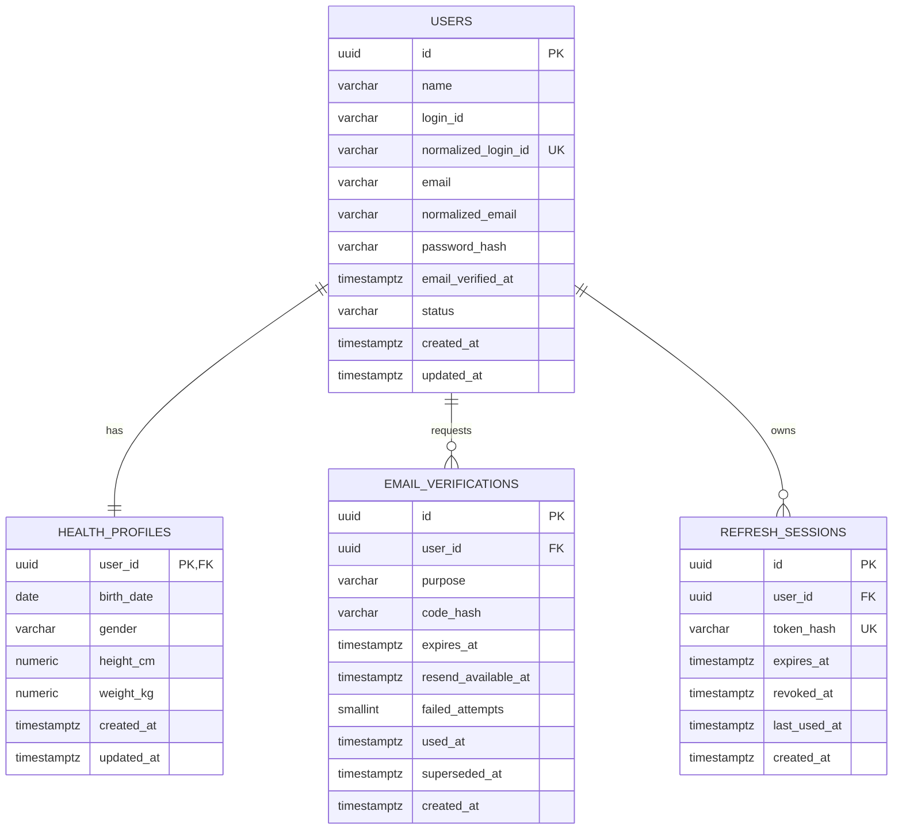
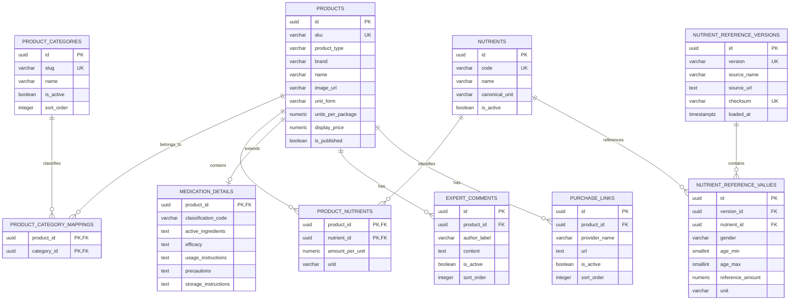
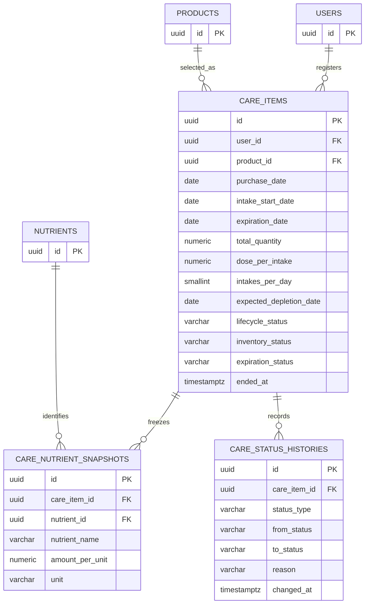
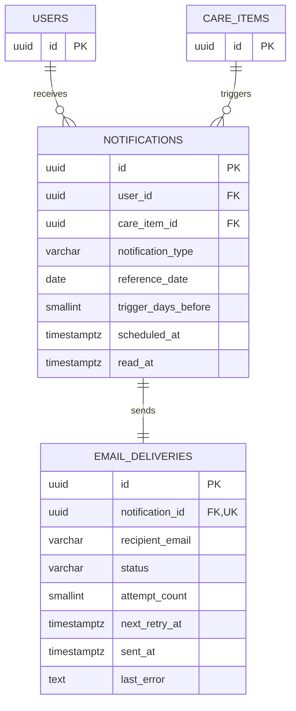

# 1차 MVP 논리 ERD

이 문서는 알약꾹 백엔드의 로컬 논리 ERD다. 외부 문서 서비스에 연결하지 않고 데이터 구조를 명세·검증할 때 사용한다. 실제 테이블과 제약은 승인된 Feature Packet과 마이그레이션에서 확정하며 데이터 변경 PR은 이 문서를 함께 갱신한다.

## 표기와 공통 규칙

- 실제 PostgreSQL 테이블명과 컬럼명은 snake_case를 사용한다.
- Mermaid 엔티티명은 가독성을 위해 대문자 snake_case로 표기한다.
- 기본 키는 UUID를 사용한다.
- 일시는 timestamptz와 UTC로 저장한다.
- 주요 변경 테이블은 created_at, updated_at을 가지며 일부 다이어그램에서는 반복을 줄이기 위해 생략한다.
- 비밀번호, 인증번호와 리프레시 토큰 원문은 저장하지 않는다.
- 카탈로그와 기준 데이터는 시드·CSV로만 적재한다.
- 이미 이력이 연결된 행은 물리 삭제보다 비활성화 또는 종료를 우선한다.

## 회원과 인증

### 책임과 제약

- users는 로그인 식별자, 이메일과 인증 상태의 원본이다.
- health_profiles는 생년월일, 성별, 키와 몸무게를 사용자와 1:1로 분리한다.
- F-1.1에서 users와 health_profiles를 실제 테이블로 생성한다.
- normalized_login_id와 normalized_email은 각각 고유하다.
- users.status는 PENDING_EMAIL_VERIFICATION, ACTIVE 또는 SUSPENDED이며 회원가입
  직후에는 PENDING_EMAIL_VERIFICATION이다.
- health_profiles.gender는 MALE 또는 FEMALE다.
- height_cm은 50~250, weight_kg은 10~500 범위로 DB CHECK를 적용한다.
- health_profiles.user_id는 PK이자 users.id FK이며 사용자 삭제 시 함께 삭제된다.
- email_verified_at이 없는 사용자는 로그인할 수 없다.
- F-1.1.3에서 email_verifications를 실제 테이블로 생성하고 users와 다대일로
  연결한다. 사용자를 삭제하면 인증 이력도 함께 삭제된다.
- email_verifications는 발급 이력마다 새 행을 만들고 10분 만료, 60초 재전송
  대기와 최대 5회 실패를 적용한다.
- purpose는 VERIFY_EMAIL, failed_attempts는 0~5 범위다. expires_at과
  resend_available_at은 created_at 이후여야 한다.
- used_at은 확인 완료, superseded_at은 새 발급에 의한 무효화를 뜻하며 한 행에 두
  값이 동시에 기록될 수 없다. 두 시각은 값이 있으면 created_at보다 빠를 수 없다.
- 사용자별 최신 발급 조회를 위해 (user_id, created_at) 복합 인덱스를 사용한다.
- F-1.2에서 refresh_sessions를 실제 테이블로 생성해 기기·세션별 만료와 폐기를
  추적하며 사용자 삭제 시 함께 삭제한다.
- token_hash는 고유하고 원문을 저장하지 않는다. expires_at은 created_at 이후,
  revoked_at과 last_used_at은 값이 있으면 created_at보다 빠를 수 없다.
- 사용자 세션 이력 조회에 (user_id, created_at), 만료 정리에 expires_at 인덱스를
  사용한다.

## 제품 카탈로그와 영양소 기준

### 책임과 제약

- products는 영양제와 의약품의 공통 카탈로그이며 product_type으로 구분한다.
- 제품과 카테고리는 다대다 관계를 기본안으로 둔다.
- product_nutrients는 영양제에만 허용하며 amount_per_unit은 0보다 커야 한다.
- 의약품의 효능, 복용법, 주의와 보관 정보는 medication_details에 저장한다.
- 전문가 소개는 프론트엔드 정적 콘텐츠이므로 1차에는 experts 테이블을 만들지 않는다.
- 영양소 기준 원본은 CSV이며 버전과 checksum을 보존한다.
- 동일 기준 버전에서 성분·성별·나이 구간이 중복되거나 겹치면 적재를 거부한다.

## 마이케어

### 책임과 제약

- care_items는 구매·복용 등록 한 건을 독립된 재고 단위로 보존한다.
- 재구매는 새 care_items 행을 만들고 기존 소진 이력을 덮어쓰지 않는다.
- total_quantity, dose_per_intake와 intakes_per_day는 0보다 커야 한다.
- 마지막 복용 예정일을 expected_depletion_date로 저장하고 D-day 기준으로 사용한다.
- 소진 D-5부터 LOW_STOCK, D-day 다음 날부터 DEPLETED다.
- 재고 상태와 유통기한 상태를 분리한다.
- 영양제만 등록 시점의 성분 스냅샷을 만들고 의약품은 영양소 합계에서 제외한다.
- 실제 복용 기록과 일일 섭취량 행은 만들지 않으며 복용 계획으로 계산한다.

## 알림과 이메일

### 책임과 제약

- notifications는 화면 내부 알림이자 논리 알림 이벤트다.
- notification_type은 1차에서 REPURCHASE 또는 EXPIRATION이다.
- trigger_days_before는 5, 3, 1 중 하나다.
- reference_date는 예상 소진일 또는 유통기한이다.
- care_item_id, notification_type, reference_date, trigger_days_before 조합을 고유하게 관리한다.
- email_deliveries.notification_id를 고유하게 관리해 이메일 중복 발송을 막는다.
- recipient_email은 발송 시점 주소를 보존하는 스냅샷이다.
- 재시도는 같은 email_deliveries 행의 상태와 시도 횟수를 갱신한다.

## 저장값과 계산값

- 사용자 나이: birth_date와 계산 기준일로 계산하며 저장하지 않는다.
- 일일 예정 섭취량: 활성 영양제 스냅샷 × 회당 복용량 × 하루 횟수로 계산한다.
- 기준량 달성 비율: 예정 섭취량과 나이·성별 기준량으로 계산한다.
- 예상 소진일: 계산 후 care_items에 저장해 알림 예약과 목록 조회에 사용한다.
- D-day: expected_depletion_date와 조회 기준일의 차이로 계산한다.
- 재고·유통기한 상태: 도메인 규칙으로 계산하고 검색·작업자 처리를 위해 저장한다.

## 권장 고유 제약과 인덱스

- users(normalized_login_id) UNIQUE
- users(normalized_email) UNIQUE
- product_category_mappings(product_id, category_id) UNIQUE
- product_nutrients(product_id, nutrient_id) UNIQUE
- nutrient_reference_values(version_id, nutrient_id, gender, age_min, age_max)
- care_items(user_id, lifecycle_status, created_at DESC)
- care_items(expected_depletion_date, inventory_status)
- care_items(expiration_date, expiration_status)
- care_nutrient_snapshots(care_item_id, nutrient_id) UNIQUE
- notifications(care_item_id, notification_type, reference_date, trigger_days_before) UNIQUE
- notifications(user_id, read_at, created_at DESC)
- email_deliveries(status, next_retry_at)

## ERD 변경 규칙

1. 데이터 변경 기능은 Feature Packet의 design.md에 영향 엔티티, 관계, 제약, 인덱스, 이력과 마이그레이션 순서를 먼저 적는다.
2. 사용자가 Feature Packet을 승인한 뒤 docs/architecture/erd.md를 갱신한다.
3. 엔티티·관계·제약 변경과 마이그레이션을 같은 기능 PR에 포함한다.
4. 데이터 변경이 없으면 Feature Packet과 PR에 ERD 변경 없음과 이유를 기록한다.
5. 기존 데이터를 삭제·축소하는 변경은 호환성, 백필, 롤백과 보존 계획을 명시한다.
6. 카탈로그 변경이 기존 care_nutrient_snapshots를 다시 계산해 덮어쓰지 않게 한다.
7. validate_erd.py와 관련 마이그레이션 검증이 통과해야 완료로 판단한다.
8. 외부 ERD 페이지는 선택적 공유 문서이며 이 파일이 구현 기준이다.

## 미확정 설계 항목

- 유통기한 필수 여부
- 복용 계획과 수량 수정 API 제공 여부
- 동일 제품의 미소진 재고가 있을 때 재구매 처리
- 복용 항목 삭제와 이력 보존 기간
- 나누어떨어지지 않는 수량의 마지막 복용일 계산
- 영양소 CSV 열, 단위 변환, 출처와 버전 규칙
- 오전 9시의 IANA 기준 시간대
- 이메일 재시도와 최종 실패 정책
- 의약품 시드 필수 필드와 분류 체계
- 제품과 카테고리의 다대다 관계 유지 여부

## 관련 문서

- docs/product/requirements.md
- docs/product/scope.md
- docs/architecture/data-model.md
- docs/architecture/domain-boundaries.md
- docs/development/database.md
- docs/features/_template/design.md
