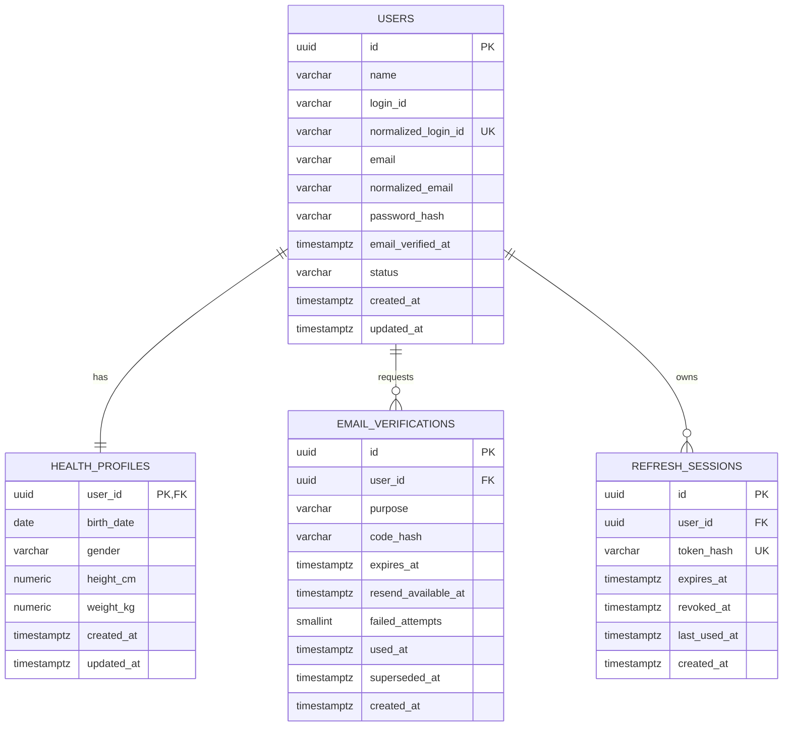
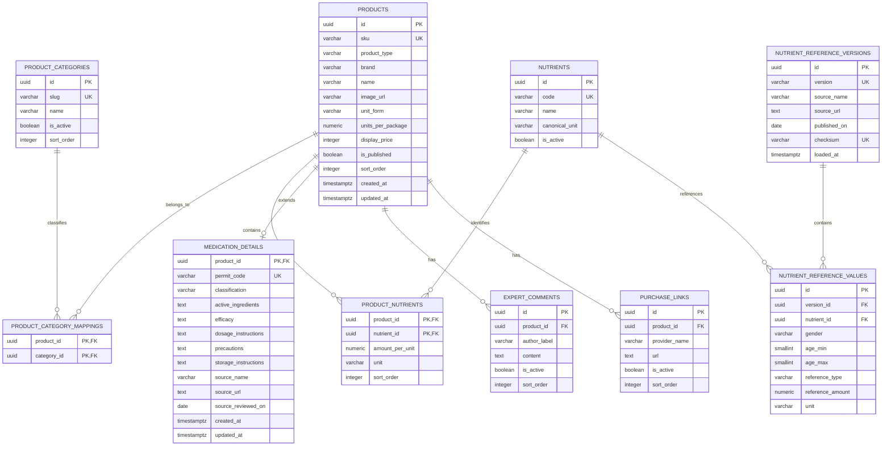
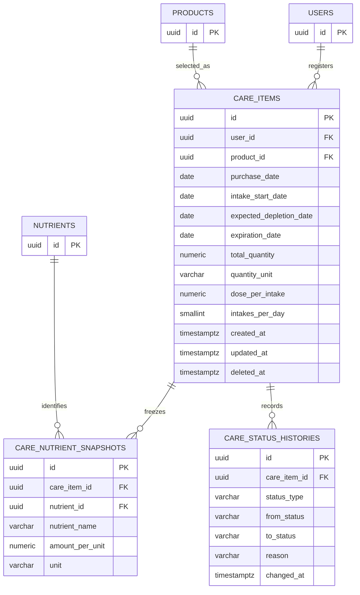
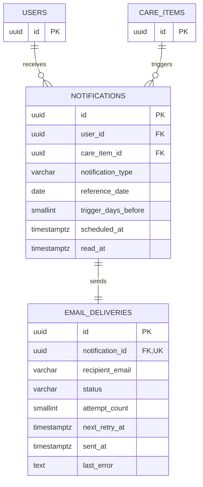

# 1차 MVP 논리 ERD

이 문서는 알약꾹 백엔드의 로컬 논리 ERD다. 외부 문서 서비스에 연결하지 않고 데이터 구조를 명세·검증할 때 사용한다. 실제 테이블과 제약은 승인된 Feature Packet과 마이그레이션에서 확정하며 데이터 변경 PR은 이 문서를 함께 갱신한다.

## 표기와 공통 규칙

- 실제 PostgreSQL 테이블명과 컬럼명은 snake_case를 사용한다.
- Mermaid 엔티티명은 가독성을 위해 대문자 snake_case로 표기한다.
- 기본 키는 UUID를 사용한다.
- 일시는 timestamptz와 UTC로 저장한다.
- 주요 변경 테이블은 created_at, updated_at을 가지며 일부 다이어그램에서는 반복을 줄이기 위해 생략한다.
- 비밀번호, 인증번호와 리프레시 토큰 원문은 저장하지 않는다.
- 카탈로그와 기준 데이터는 시드·CSV로만 적재한다.
- 이미 이력이 연결된 행은 물리 삭제보다 비활성화 또는 종료를 우선한다.

## 회원과 인증

### 책임과 제약

- users는 로그인 식별자, 이메일과 인증 상태의 원본이다.
- health_profiles는 생년월일, 성별, 키와 몸무게를 사용자와 1:1로 분리한다.
- F-1.1에서 users와 health_profiles를 실제 테이블로 생성한다.
- normalized_login_id와 normalized_email은 각각 고유하다.
- users.status는 PENDING_EMAIL_VERIFICATION, ACTIVE 또는 SUSPENDED이며 회원가입
  직후에는 PENDING_EMAIL_VERIFICATION이다.
- health_profiles.gender는 MALE 또는 FEMALE다.
- height_cm은 50~250, weight_kg은 10~500 범위로 DB CHECK를 적용한다.
- health_profiles.user_id는 PK이자 users.id FK이며 사용자 삭제 시 함께 삭제된다.
- email_verified_at이 없는 사용자는 로그인할 수 없다.
- F-1.1.3에서 email_verifications를 실제 테이블로 생성하고 users와 다대일로
  연결한다. 사용자를 삭제하면 인증 이력도 함께 삭제된다.
- email_verifications는 발급 이력마다 새 행을 만들고 10분 만료, 60초 재전송
  대기와 최대 5회 실패를 적용한다.
- purpose는 VERIFY_EMAIL, failed_attempts는 0~5 범위다. expires_at과
  resend_available_at은 created_at 이후여야 한다.
- used_at은 확인 완료, superseded_at은 새 발급에 의한 무효화를 뜻하며 한 행에 두
  값이 동시에 기록될 수 없다. 두 시각은 값이 있으면 created_at보다 빠를 수 없다.
- 사용자별 최신 발급 조회를 위해 (user_id, created_at) 복합 인덱스를 사용한다.
- F-1.2에서 refresh_sessions를 실제 테이블로 생성해 기기·세션별 만료와 폐기를
  추적하며 사용자 삭제 시 함께 삭제한다.
- token_hash는 고유하고 원문을 저장하지 않는다. expires_at은 created_at 이후,
  revoked_at과 last_used_at은 값이 있으면 created_at보다 빠를 수 없다.
- 사용자 세션 이력 조회에 (user_id, created_at), 만료 정리에 expires_at 인덱스를
  사용한다.
- F-1.3 refresh 성공은 expires_at을 연장하지 않고 token_hash와 last_used_at만
  갱신한다. 로그아웃·이전 토큰 재사용·비활성 계정은 revoked_at을 기록하며 행을
  물리 삭제하지 않는다. 이 상태 전이는 기존 컬럼을 사용하므로 ERD 구조는 바뀌지 않는다.

## 제품 카탈로그와 영양소 기준

### 책임과 제약

- products는 영양제와 의약품의 공통 카탈로그이며 product_type으로 구분한다.
- F-2.2에서 product_categories를 실제 테이블로 구현한다. slug는 소문자 영숫자와
  내부 하이픈 형식의 고유 자연 키이고, name은 trim 기준 1~50자, sort_order는 0
  이상이다. 활성 목록 조회는 (is_active, sort_order, slug) 인덱스를 사용한다.
- `all`·`전체`는 분류 행이 아닌 필터 미적용 가상 응답이므로 product_categories와
  향후 product_category_mappings에 저장하지 않는다.
- F-2.3에서 products·product_category_mappings를 실제 구현한다. 제품은 sku 고유 자연
  키, SUPPLEMENT 또는 MEDICATION 유형, 비공백 브랜드·이름·이미지 URL, 허용 package
  단위, 양수 총 단위 수, 0 이상 표시 가격·정렬 순서와 updated_at >= created_at 제약을
  가진다.
- 제품과 카테고리는 다대다이며 매핑의 product_id·category_id를 복합 PK로 사용한다.
  양쪽 원본 삭제 시 매핑은 CASCADE하고 category_id·product_id 조회 인덱스를 둔다.
- 공개 추천 목록은 게시 제품이면서 활성 카테고리 연결이 최소 하나 있어야 한다.
  products의 (is_published, sort_order, sku) 인덱스로 편집 순서를 안정화한다.
- F-2.3은 패키지 필드를 제품 시드와 함께 저장하지만 구성 성분 관계와 상세 API는
  F-2.4에서 구현한다.
- F-2.4에서 nutrients·product_nutrients를 실제 테이블로 구현한다. nutrient code는
  대문자 영숫자와 내부 밑줄 형식의 고유 자연 키이고, name은 trim 기준 1~100자다.
  canonical_unit은 MG·G·MCG·IU 중 하나이며 활성 조회는 (is_active, code) 인덱스를
  사용한다.
- product_nutrients는 영양제에만 허용하며 amount_per_unit은 0보다 크고 unit은
  MG·G·MCG·IU, sort_order는 0 이상이어야 한다. 제품별 성분 조회는
  (product_id, sort_order, nutrient_id) 인덱스를 사용한다.
- 제품 삭제 시 성분 매핑은 CASCADE하지만 참조 중인 nutrient 삭제는 RESTRICT하고
  is_active=false 비활성화를 우선한다. 성분 기준 단위와 제품 함량 단위의 일치는
  1차 시드와 향후 쓰기 서비스에서 검증한다.
- 공개 제품 상세는 게시 제품과 활성 카테고리 연결을 요구하고 활성 성분만
  product_nutrients.sort_order, nutrients.code 순으로 제공한다.
- F-2.4.1에서 expert_comments를 실제 테이블로 구현한다. UUID PK와 product_id FK,
  trim 기준 1~100자 author_label, 1~2000자 일반 문자열 content, 활성 여부와 0 이상
  sort_order를 가진다.
- 제품 삭제 시 코멘트는 CASCADE하며 공개 상세는 활성 코멘트만 sort_order·id로
  정렬한다. `(product_id, is_active, sort_order, id)` 인덱스를 사용한다.
- F-2.1 전문가 소개가 프론트엔드 정적 콘텐츠이므로 experts 테이블을 만들지 않고
  author_label을 표시 스냅샷으로 보존한다.
- F-2.4.2에서 purchase_links를 실제 테이블로 구현한다. UUID PK와 product_id FK,
  trim 기준 1~100자 provider_name, 9~2048자 HTTPS URL, 활성 여부와 0 이상 sort_order를
  가진다. URL은 공백·fragment와 authority userinfo를 허용하지 않는다.
- 제품 삭제 시 구매 링크는 CASCADE하며 이동 API는 활성 링크만 sort_order·id로
  정렬해 첫 항목을 선택한다. `(product_id, is_active, sort_order, id)` 인덱스를 사용한다.
- 구매 이동은 클릭·사용자·구매 이력을 저장하지 않으므로 1차 ERD에 추적 엔티티를
  추가하지 않는다.
- F-3.10에서 medication_details를 실제 구현한다. Product와 1:0..1 관계이며
  Product 삭제 시 CASCADE하지만 CareItem이 참조하는 Product는 기존 RESTRICT 규칙으로
  보호한다. permit_code는 형식 검증된 고유 품목 추적 코드, classification은 OTC 또는
  PRESCRIPTION이다.
- 유효성분 요약·효능·용법·주의·보관·출처명·HTTPS URL·출처 검토일은 모두 필수다.
  출처 URL은 공백·fragment·authority userinfo를 허용하지 않고 상세의 수정 시각은 생성
  시각보다 빠를 수 없다. `(classification, product_id)` 인덱스를 둔다.
- 보호 의약품 목록·상세는 게시 MEDICATION Product와 상세가 모두 있는 행만 제공하고
  기존 `(is_published, sort_order, sku)` 인덱스로 안정 정렬한다. 로컬 시드는 실사용
  금지 예시로 명시하며 운영 전 품목별 공식 출처 검토가 필요하다.
- 전문가 소개는 프론트엔드 정적 콘텐츠이므로 1차에는 experts 테이블을 만들지 않는다.
- F-3.6에서 두 기준 엔티티를 실제 테이블로 구현한다. 기준 버전은 고유 version·
  checksum, 출처명·HTTPS URL·발행일·적재 시각을 보존한다.
- 기준값은 버전과 Nutrient를 참조하고 성별 MALE/FEMALE, 0~120세 나이 구간,
  RNI/AI 유형, 양수 Decimal 기준량과 MG·G·MCG·IU 단위를 가진다. 버전 삭제 시 값은
  CASCADE하고 성분 삭제는 RESTRICT한다.
- 동일 버전·성분·성별·나이 구간·유형은 UNIQUE이며
  `(version_id, gender, age_min, age_max, nutrient_id)`로 조회한다. 겹치는 구간,
  중복 키, 성분 기준 단위 불일치와 메타데이터 불일치는 전체 적재 전에 거부한다.
- 기준 원본은 `data/reference/nutrient_reference_kdri_2025.csv`이고 파일 전체 SHA-256을
  보존한다. 같은 버전 재적재는 결정적 UUID로 원자 교체해 같은 상태로 수렴한다.

## 마이케어

### 책임과 제약

- care_items는 구매·복용 등록 한 건을 독립된 재고 단위로 보존한다.
- 재구매는 새 care_items 행을 만들고 기존 소진 이력을 덮어쓰지 않는다.
- F-3.1에서 care_items를 실제 테이블로 구현한다. user_id는 users.id를 참조하고
  사용자 삭제 시 CASCADE하며, product_id는 products.id를 참조하고 제품 삭제는
  RESTRICT한다.
- intake_start_date는 purchase_date 이상이어야 한다. 미래 구매일 금지는 변하는 서버
  날짜를 DB CHECK에 넣지 않고 등록 서비스에서 검증한다.
- total_quantity와 dose_per_intake는 NUMERIC(12,3), 0 초과
  999999999.999 이하이며 dose_per_intake는 total_quantity 이하다.
- F-3.3에서 total_quantity는 해당 구매 항목의 최초 구매 총량으로 확정하고
  quantity_unit을 실제 컬럼으로 추가한다. quantity_unit은 등록 시 Product.unit_form을
  복사한 TABLET·CAPSULE·SCOOP·PACKET 중 하나이며 이후 카탈로그 변경으로 갱신하지
  않는다.
- 같은 제품을 소진 전에 다시 사도 기존 항목의 수량을 합산·수정하지 않고 새
  CareItem으로 보존한다. 실제 복용 기록이 없으므로 mutable 잔량 컬럼은 만들지 않는다.
- F-3.4에서 삭제는 물리 삭제가 아니라 nullable deleted_at을 서버 시각으로 기록하는
  소프트 삭제로 처리한다. 삭제된 CareItem과 성분 스냅샷은 보존하며 활성 목록과 후속
  계산·알림 대상에서는 제외한다. deleted_at은 NULL이거나 created_at 이상이어야 한다.
- intakes_per_day는 1~24이고 updated_at은 created_at보다 빠를 수 없다. 소프트 삭제
  때 deleted_at과 updated_at을 같은 시각으로 기록한다.
- 사용자별 최신 이력은 `(user_id, created_at, id)`, 제품 참조는 `product_id`
  인덱스를 사용한다. 활성 목록은 같은 열의 `deleted_at IS NULL` 부분 인덱스를 사용하고
  B-tree 역방향 스캔으로 최신순 조회를 지원한다.
- F-3.7에서 expected_depletion_date를 실제 NOT NULL 컬럼으로 추가한다. 값은
  `intake_start_date + ceil(total_quantity / (dose_per_intake × intakes_per_day)) - 1일`
  이며 시작일보다 빠를 수 없다. 기존 활성·삭제 행을 모두 같은 공식으로 백필한다.
- 예상 소진일 기반 작업 조회에는 `(expected_depletion_date, user_id)` 인덱스를 사용한다.
  D-day는 APP_TIMEZONE 오늘과의 날짜 차이로 읽을 때 계산하고 저장하지 않는다.
- F-3.11에서 구매분별 nullable expiration_date를 실제 컬럼으로 추가한다. 날짜를
  모르는 기존·신규 항목은 null이고 만료 알림 대상에서 제외한다. 과거 날짜와 구매일
  이전 날짜도 기록 목적으로 허용하며 `(expiration_date, user_id)` 인덱스를 사용한다.
- 유통기한 D-day는 APP_TIMEZONE 오늘과의 날짜 차이로 읽을 때 계산한다. D-6 이상은
  NORMAL, D-5부터 D0은 EXPIRING_SOON, 이후는 EXPIRED이며 상태는 저장하지 않는다.
  예상 소진일·재고 상태와 독립적으로 관리한다.
- F-3.2에서 care_nutrient_snapshots를 실제 테이블로 구현한다. SUPPLEMENT 등록 시
  활성 성분의 nutrient_id·당시 이름·단위당 함량·단위를 복사하며 MEDICATION과
  활성 성분이 없는 영양제는 스냅샷을 만들지 않는다.
- `(care_item_id, nutrient_id)`는 고유하고 amount_per_unit은 NUMERIC(12,4)의
  양수, nutrient_name은 trim 기준 1~100자, unit은 MG·G·MCG·IU 중 하나다.
- care_item 행을 물리 삭제하면 스냅샷은 CASCADE하고 nutrient 삭제는 RESTRICT한다.
  F-3.4 사용자 소프트 삭제는 스냅샷을 보존한다. 영양성분 참조 조회에는
  `nutrient_id` 인덱스를 사용한다.
- 제품·성분 카탈로그가 바뀌어도 이미 저장한 스냅샷은 갱신·삭제하지 않는다.
  0012 적용 전에 존재한 영양제 항목은 적용 시점의 활성 카탈로그 값으로 한 번
  백필한다.
- 실제 복용 기록과 일일 섭취량 행은 만들지 않으며 복용 계획으로 계산한다.

## 알림과 이메일

### 책임과 제약

- notifications는 화면 내부 알림이자 논리 알림 이벤트다.
- notification_type은 1차에서 REPURCHASE 또는 EXPIRATION이다.
- trigger_days_before는 5, 3, 1 중 하나다.
- reference_date는 예상 소진일 또는 유통기한이다.
- care_item_id, notification_type, reference_date, trigger_days_before 조합을 고유하게 관리한다.
- email_deliveries.notification_id를 고유하게 관리해 이메일 중복 발송을 막는다.
- recipient_email은 발송 시점 주소를 보존하는 스냅샷이다.
- 재시도는 같은 email_deliveries 행의 상태와 시도 횟수를 갱신한다.

## 저장값과 계산값

- 사용자 나이: birth_date와 계산 기준일로 계산하며 저장하지 않는다.
- 일일 예정 섭취량: F-3.5에서 사용자 소유의 삭제되지 않은 영양제 스냅샷 × 회당
  복용량 × 하루 횟수로 요청마다 계산한다. G·MG·MCG는 Nutrient 기준 단위로 환산해
  합산하고 IU는 IU끼리만 합산하며 별도 행으로 저장하지 않는다.
- 기준량 달성 비율: 예정 섭취량과 나이·성별 기준량으로 계산한다.
- F-3.6 기준량 달성 비율은 저장하지 않고 `일일 예정량 / RNI 또는 AI × 100`으로
  요청마다 Decimal 계산한다. 일반 OMEGA_3처럼 정확히 매핑할 공식 기준이 없으면
  현재량만 반환하고 기준 필드는 비워 둔다.
- 예상 소진일: F-3.7에서 등록 시 계산해 care_items에 저장하고 알림 기준일로 사용한다.
- D-day: expected_depletion_date와 APP_TIMEZONE 조회일의 부호 있는 일수 차이이며
  날짜 경과에 따라 바뀌므로 저장하지 않는다.
- 유통기한 상태: F-3.11에서 nullable expiration_date로부터 조회 시 계산하며 저장하지
  않는다. 재고 상태는 F-3.8에서 예상 소진일로부터 별도로 계산한다.

## 권장 고유 제약과 인덱스

- users(normalized_login_id) UNIQUE
- users(normalized_email) UNIQUE
- product_category_mappings(product_id, category_id) UNIQUE
- product_nutrients(product_id, nutrient_id) UNIQUE
- nutrient_reference_values(version_id, nutrient_id, gender, age_min, age_max)
- care_items(user_id, created_at, id)
- care_items(product_id)
- care_items(expected_depletion_date, user_id) — F-3.7 구현
- medication_details(permit_code) UNIQUE — F-3.10 구현
- medication_details(classification, product_id) — F-3.10 구현
- care_items(expiration_date, user_id) — F-3.11 구현
- care_nutrient_snapshots(care_item_id, nutrient_id) UNIQUE
- notifications(care_item_id, notification_type, reference_date, trigger_days_before) UNIQUE
- notifications(user_id, read_at, created_at DESC)
- email_deliveries(status, next_retry_at)

## ERD 변경 규칙

1. 데이터 변경 기능은 Feature Packet의 design.md에 영향 엔티티, 관계, 제약, 인덱스, 이력과 마이그레이션 순서를 먼저 적는다.
2. 사용자가 Feature Packet을 승인한 뒤 docs/architecture/erd.md를 갱신한다.
3. 엔티티·관계·제약 변경과 마이그레이션을 같은 기능 PR에 포함한다.
4. 데이터 변경이 없으면 Feature Packet과 PR에 ERD 변경 없음과 이유를 기록한다.
5. 기존 데이터를 삭제·축소하는 변경은 호환성, 백필, 롤백과 보존 계획을 명시한다.
6. 카탈로그 변경이 기존 care_nutrient_snapshots를 다시 계산해 덮어쓰지 않게 한다.
7. validate_erd.py와 관련 마이그레이션 검증이 통과해야 완료로 판단한다.
8. 외부 ERD 페이지는 선택적 공유 문서이며 이 파일이 구현 기준이다.

## 미확정 설계 항목

- 복용 계획과 수량 수정 API 제공 여부
- 삭제된 복용 항목의 복원·물리 정리와 이력 보존 기간
- 나누어떨어지지 않는 수량의 마지막 복용일 계산
- 오전 9시의 IANA 기준 시간대
- 이메일 재시도와 최종 실패 정책
- 제품과 카테고리의 다대다 관계 유지 여부

## 관련 문서

- docs/product/requirements.md
- docs/product/scope.md
- docs/architecture/data-model.md
- docs/architecture/domain-boundaries.md
- docs/development/database.md
- docs/features/_template/design.md
